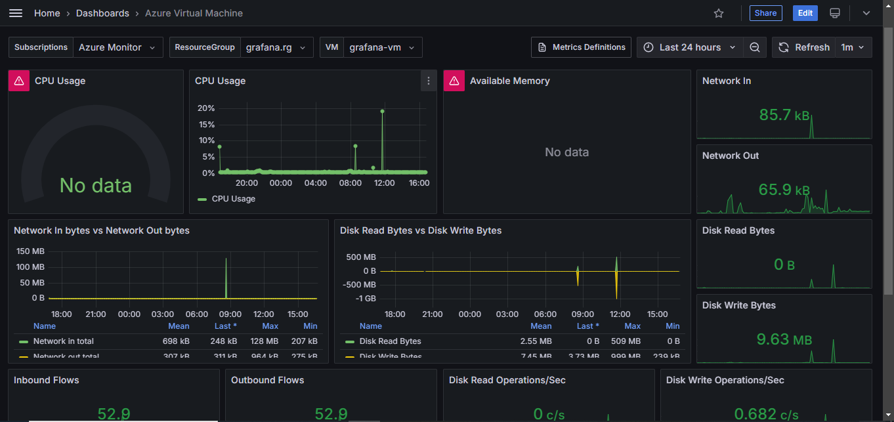

---

# Azure VM Monitoring with Grafana Integration

## 📄 Description  
This project demonstrates the integration of **Grafana**, a powerful monitoring and analytics platform, with the **real-time environment** of a virtual machine hosted on **Microsoft Azure**.
The project showcases how Grafana can be used to visualize and monitor system metrics and performance data effectively in a cloud-based virtual machine setup.

---

## 🚀 Key Features  
- Real-Time Monitoring: Displays live metrics and system data from the Azure VM.  
- Grafana Dashboards: Customizable dashboards for visualizing CPU usage, memory consumption, disk I/O, and network activity.  
- Seamless Integration: Uses Grafana's plugins and Azure's monitoring tools for efficient data flow.  
- Scalable Setup: Suitable for small to large-scale VM deployments.  

---

## 🛠️ Technologies Used  
- Grafana: For data visualization and monitoring.  
- Azure Virtual Machines: Hosting the environment being monitored.  
- Azure Monitor or Logs Analytics: For data aggregation and exporting metrics.  
- Prometheus: Used as a data source for Grafana.  

---

## 🖥️ How to Use  
1. Set Up Azure VM:  
   - Launch a virtual machine in Microsoft Azure.  
   - Enable necessary monitoring tools (e.g., Azure Monitor).  

2. Install Grafana:  
   - Install Grafana on your local machine or another VM.  
   - Configure Grafana to connect with the Azure environment.  

3. Connect Data Sources:  
   - Add **Azure Monitor** or other compatible data sources to Grafana.  
   - Import the relevant metrics and logs.  

4. -Create Dashboards:  
   - Use Grafana’s intuitive interface to build custom dashboards.  

5. -Monitor in Real-Time:  
   - View and analyze live metrics for system performance and alerts.  

---

## 📷 Grafana Dashboard

Below is a screenshot of the Grafana dashboard integrated with the Azure Virtual Machine real-time environment:

  
---

## 📚 Documentation  
For detailed guidance on using Grafana with Azure, refer to the [Grafana Docs](https://grafana.com/docs/) and [Azure Monitor Documentation](https://learn.microsoft.com/en-us/azure/azure-monitor/).  

---

## 📞 Contact  
Feel free to reach out if you have any questions or suggestions:  
- Email: [deeksha2005agarwal@gmail.com]  
- GitHub: [https://github.com/hello-codin]  

---
